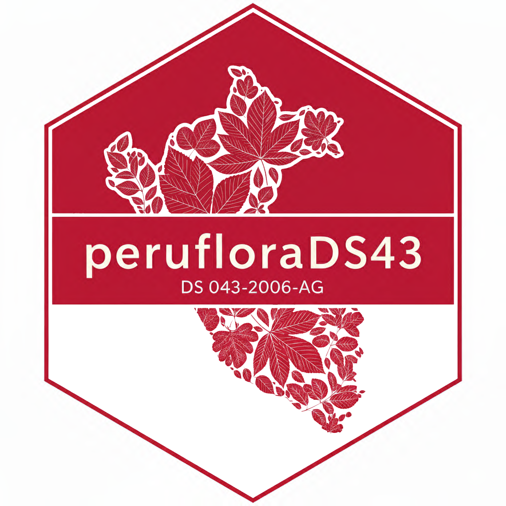

<!-- README.md is generated from README.Rmd. Please edit that file -->

```{r, include = FALSE}
knitr::opts_chunk$set(
  collapse = TRUE,
  comment = "#>",
  fig.path = "man/figures/README-",
  out.width = "100%"
)
```

# threatenedperu <a href='https://github.com/PaulESantos/threatenedperu'></a>

<!-- badges: start -->
[](https://lifecycle.r-lib.org/articles/stages.html#experimental)
[](https://CRAN.R-project.org/package=threatenedperu)
<!-- badges: end -->

## Overview

`threatenedperu` provides tools to work with threatened plant species data from Peru as categorized under **Decreto Supremo N° 043-2006-AG**. The package contains data on 777 threatened species distributed across four IUCN threat categories, with sophisticated name matching algorithms that handle taxonomic synonyms and nomenclatural changes since the list where stablished.

## Key Features

-  Comprehensive name matching: Direct, fuzzy, and suffix-based matching algorithms
-  Synonym resolution: Automatic handling of nomenclatural changes since 2006
-  Complete threat data: 777 species across CR, EN, VU, and NT categories
-  Validation tools: Check species protection status against official document
-  Conservation workflows: Tools for reports, management plans, and monitoring

## Legal Framework

The package implements the official categorization from:
**Decreto Supremo N° 043-2006-AG (July 13, 2006)** **Aprueban Categorización de Especies Amenazadas de Flora Silvestre**

- Categories (following IUCN criteria):

- CR `(Critically Endangered)`: 
- EN `(Endangered)`: 
- VU `(Vulnerable)`: 
- NT `(Near Threatened)`: 

## Installation

Install from CRAN:

```r
install.packages("peruflorads43")

# or

pak::pak("peruflorads43")
```
Or install the development version from GitHub:

``` r
pak::pak("PaulEsantos/peruflorads43")
```
